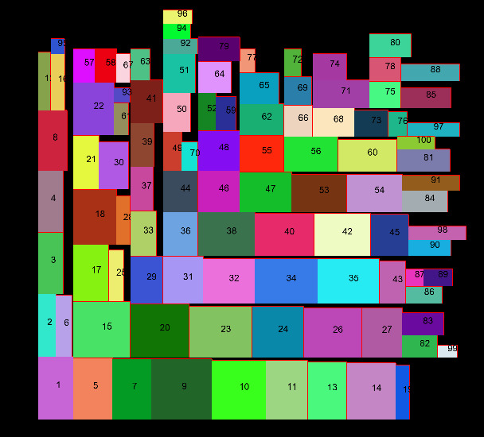

# RectanglePacker

Aim : To pack the list of rectangles into the smallest possible square.

## The Workflow
- The rectangles are read through the object RectLoader. For each rectangle, an object *Rect* is created.

- The rectangles are sorted according to their height.

- The sum of all the areas are calculated to find the initial square edge for the final square of packing.

- A class called "PackNode" is used to pack the nodes into the square. 

- The pack node is extended until all the rectangles are fit in.

- The final square is the minimum square that all the rectangles may fit it. 

- The output is printed out as *csv* for excel and *.m* for matlab for visualization purposes. 

------------------------------
### PackNode class:
Pack node class is the class finding a place to fit the rectangle. The class works recursively, with the idea of binary search. The insert function checks and finds the location for the rectangular given. The flow is as the following:
- It first checks if the object has children. If yes, one by one, it tries to fit the rectangular.
- If no child node exist, then it first check if the node is big enough for the new rectangular, or if there is another inside. 
- If not that means we have a region, that is larger than the current rectangle. 
- It decides which direction to split it(Vertical or horizontal). And splits it into two.
- Finally insert the rectangle to child nodes.
-----------------------------
## Input and Output:
#### Input:
An example txt file, left column is width, right column is height:
```
40 46
11 15
27 41
31 40
16 37
35 10
40 50
15 24
17 39
17 50
```
#### Output: 
CSV(for excel) or .m(for Matlab or [Octave-Online](https://octave-online.net/)) file.

### Screenshot:
The square is 109x109:


